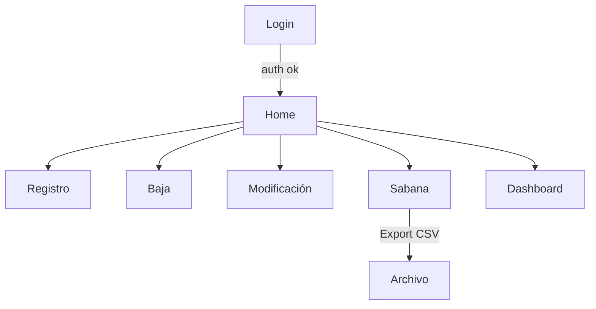

# UNIGIS POS — Points of Sale Platform

*React + TypeScript + ASP.NET Core + SQL Server + Azure Static Web Apps / App Service*

<p align="center">
  
  
  
  
</p>

> Plataforma integral para **gestionar** puntos de venta, **visualizarlos** en mapa, **analizar** KPIs y **reportar/exportar** datos. Incluye autenticación, CRUD, dashboard con gráficas y despliegue en Azure con CI/CD.

---

## ✨ Features

* 🔐 **Auth** (login/registro, hash de contraseña en servidor).
* 🗺️ **Mapa interactivo** con Leaflet (picking de coordenadas y visualización).
* 🧾 **CRUD completo** de puntos de venta (alta, baja, edición, consulta).
* 📈 **Dashboard**: KPIs, donut/line/bar charts (Recharts) y top puntos.
* 📊 **Sabana de datos**: filtros, totales y **export CSV**.
* 🧪 **Swagger** para probar la API.
* ☁️ **Despliegue cloud**:

  * Frontend → **Azure Static Web Apps** (SWA) con *proxy* a la API.
  * Backend → **Azure App Service** (.NET 8/7) con EF Core y migraciones.
* 🕒 **Buenas prácticas SQL**: SPs con validaciones y timestamps zona **CDMX**.

---

## 🏗️ Arquitectura (alto nivel)

```mermaid

flowchart LR
    A[React SPA (Azure Static Web Apps)<br/>/staticwebapp.config.json] --> |/auth/* & /api/* proxy| B[ASP.NET Core API<br/>(App Service)]
    B --> |EF Core / SPs| C[(SQL Server)]

```

* **SWA** sirve la SPA y **reenvía** `/auth/*` y `/api/*` a la API.
* **App Service** expone `/api/*` (p.ej. `/api/Auth/login`, `/api/Points`).
* **SQL Server** persiste `AppUser` y `PointOfSale` (SPs de inserción/edición, listados, agregados por zona, etc.).

---

## 🧰 Tech Stack

* **Frontend**: React + TypeScript, React Router, Axios, Leaflet, Recharts, CSS.
* **Backend**: ASP.NET Core Web API, EF Core, Identity `PasswordHasher<T>`, Swagger.
* **Database**: SQL Server + Procedimientos almacenados (validaciones y timestamps CDMX).
* **Cloud**: Azure Static Web Apps (SPA) + Azure App Service (API).
* **CI/CD**: GitHub Actions (build & deploy del frontend).

---

## 📂 Estructura (resumen)

```
frontend/
  src/
    api/                # cliente axios
    auth/               # AuthContext, RequireAuth
    components/         # MapView, tablas, KPIs, gráficas, sidebar, topbar
    pages/              # Login, Register, Create, Edit, Delete, Report, Dashboard...
    styles/             # globals.css, layout.css
    types/              # .d.ts
    utils/              # kpis.ts (formateos/cálculos)
  App.tsx, index.tsx
  staticwebapp.config.json  # rutas y proxy de SWA
  .env                      # solo local

backend/PuntosVenta.Api/PuntosVenta.Api/
  Controllers/          # AuthController, PointsController
  Services/             # AuthService, PointService
  Data/                 # AppDbContext, Configurations
  Domain/               # AppUser, PointOfSale
  Dto/                  # DTOs de entrada/salida
  appsettings.json
  Program.cs
```

---

## 🧑‍💻 Frontend

**Cliente HTTP** (`src/api/http.ts`):

* **Local** usa `.env`:

  ```env
  REACT_APP_API_BASE=http://localhost:5000/api
  ```
* **Producción (SWA)**: no definas base — llama a `/auth/*` y `/api/*`; SWA **proxifica** a la API.

**Scripts**:

```bash
cd frontend
npm ci
npm start       # dev
npm run build   # prod (artefacto en /build)
```

> Si el build se queja de `react-is`, agrega la dependencia: `npm i react-is --save`.

---

## ⚙️ Backend (API)

* Controladores: `/api/Auth/*` y `/api/Points/*`.
* Servicios: separación de lógica (`AuthService`, `PointService`).
* EF Core + Fluent Configurations por entidad.
* `Program.cs`:

  * `UseHttpsRedirection()`, `UseRouting()`, `UseCors()`.
  * Swagger habilitable por configuración.
* **CORS**:

  * Dev: permisivo para agilidad.
  * Prod: **restringe** a dominios de tu SWA.

**Run local**:

```bash
cd backend/PuntosVenta.Api/PuntosVenta.Api
dotnet restore
dotnet ef database update   # si usas migraciones
dotnet run                  # API en http://localhost:5000
```

---

## 🗄️ Base de datos & SPs

**Tablas** (campos clave)

* `dbo.AppUser`: `Id, UserName (único), PasswordHash, Zone, IsAdmin, CreatedAt`
* `dbo.PointOfSale`: `Id, Latitude, Longitude, Description, Sale, Zone, CreatedAt, UpdatedAt`

**Procedimientos** (con cabecera, validaciones y hora **CDMX**)

* `dbo.usp_AppUser_GetByUserName`
* `dbo.usp_AppUser_Insert`
* `dbo.usp_AppUser_SetPasswordHash`
* `dbo.usp_AppUser_UpsertAdmin` *(opcionalmente limpia otros usuarios)*
* `dbo.usp_PointOfSale_Create` / `dbo.usp_PointOfSale_Update` / `dbo.usp_PointOfSale_Delete`
* `dbo.usp_PointOfSale_GetById` / `dbo.usp_PointOfSale_List` (paginado)
* `dbo.usp_PointOfSale_SalesByZone` (SUM por zona)

> Los SPs usan `SYSUTCDATETIME() AT TIME ZONE 'Central Standard Time (Mexico)'` para registrar `CreatedAt/UpdatedAt` en horario CDMX.

---

## 🔐 Endpoints principales

**Auth**

* `POST /api/Auth/login`
* `POST /api/Auth/register` *(si está habilitado)*

**Points**

* `GET    /api/Points`
* `POST   /api/Points`
* `GET    /api/Points/{id}`
* `PUT    /api/Points/{id}`
* `DELETE /api/Points/{id}`
* `GET    /api/Points/sales-by-zone`

> Explóralos en **Swagger** (`/swagger`) cuando esté permitido por configuración.

---

## 🌐 Configuración de entornos

### Static Web Apps — Proxy & SPA fallback

`frontend/staticwebapp.config.json` (ejemplo):

```json
{
  "navigationFallback": { "rewrite": "/index.html" },
  "routes": [
    { "route": "/api/*",  "allowedRoles": ["anonymous"], "rewrite": "https://<tu-appservice>.azurewebsites.net/api/*" },
    { "route": "/auth/*", "allowedRoles": ["anonymous"], "rewrite": "https://<tu-appservice>.azurewebsites.net/api/Auth/*" }
  ]
}
```

> Reemplaza `<tu-appservice>` por el host real de tu App Service.
> Tras desplegar, en **SWA → Configuration → Routes** deben verse estas reglas.

### Variables

| Entorno    | Frontend                            | Backend                                  |
| ---------- | ----------------------------------- | ---------------------------------------- |
| Local      | `.env` → `REACT_APP_API_BASE=/api`  | `appsettings.json` → `DefaultConnection` |
| Producción | **sin** base (usa `/auth` y `/api`) | Connection String en **App Service**     |

---

## 🚀 Despliegue

### Frontend — Azure Static Web Apps (SWA)

* `app_location: frontend`
* `output_location: build`
* `staticwebapp.config.json` **en el repo** (raíz o `config_file_location` en el action).

### Backend — Azure App Service

* Publica la API.
* Configura `DefaultConnection`.
* Opcional: habilita logs/diagnóstico para troubleshooting.

---

## 🤖 CI/CD (GitHub Actions)

Ejemplo de job de build & deploy del **frontend**:

```yaml
name: Azure Static Web Apps CI/CD

on:
  push: { branches: [ "main" ] }
  pull_request:
    types: [opened, synchronize, reopened, closed]
    branches: [ "main" ]

jobs:
  build_and_deploy_job:
    if: github.event_name == 'push' || (github.event_name == 'pull_request' && github.event.action != 'closed')
    runs-on: ubuntu-latest
    steps:
      - uses: actions/checkout@v4
      - uses: actions/setup-node@v4
        with: { node-version: '20' }
      - name: Build And Deploy (SWA)
        uses: Azure/static-web-apps-deploy@v1
        with:
          azure_static_web_apps_api_token: ${{ secrets.AZURE_STATIC_WEB_APPS_API_TOKEN_ICY_SAND_001825E10 }}
          repo_token: ${{ secrets.GITHUB_TOKEN }}
          action: upload
          app_location: frontend
          output_location: build
          production_branch: main
          app_build_command: "npm ci --legacy-peer-deps --no-audit --no-fund && CI=false npm run build"
        env:
          CI: false
```

> **Secrets**: `AZURE_STATIC_WEB_APPS_API_TOKEN_ICY_SAND_001825E10` (tu token de SWA).

---

## 🧭 Navegación de la app



* **Registro**: formulario con botón *Ver mapa* para elegir coordenadas.
* **Baja**/**Modificación**: listado + acciones por registro (confirmación/edición).
* **Sabana de Datos**: buscador, filtro por zona, totales y **exportación CSV**.
* **Dashboard**: mapa de puntos + KPIs y gráficas (donut, línea, barras/top).

---

## 🛡️ Seguridad & Buenas prácticas

* CORS restringido en producción.
* Swagger **apagado** en producción o tras autenticación.
* Habilita `UseHsts()` cuando `!IsDevelopment()`.
* Nunca subas **secrets** al repo (usa App Settings / GitHub Secrets).
* `.gitignore` incluye `build/`, `bin/`, `obj/`, `.vs/`, `*.user`, `PublishProfiles/`.

---

